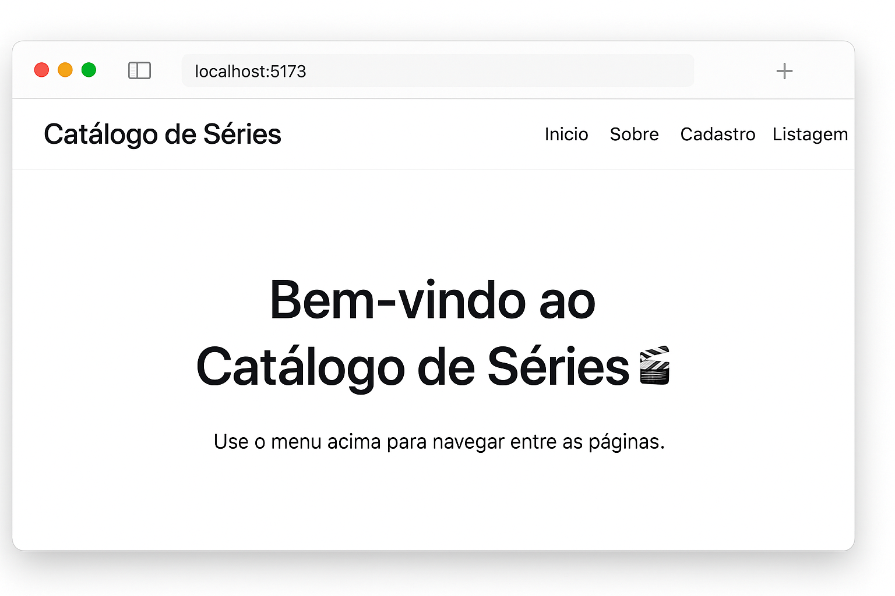

# 🎬 Catálogo de Séries

Este projeto foi desenvolvido como parte da **Fase 1** da disciplina de **Desenvolvimento Front-End**, do curso de **Análise e Desenvolvimento de Sistemas da PUCRS**.

O objetivo é criar uma aplicação React para **cadastrar, listar, editar e excluir séries**, com navegação entre páginas e componentização adequada.

---

## 🚀 **Como executar o projeto**

### 1️⃣ Pré-requisitos
- Node.js instalado
- npm (gerenciador de pacotes)

### 2️⃣ Clonar o repositório
```bash
git clone https://github.com/dionatanhc/desenvolvimento_de_sistemas_frontend.git
cd desenvolvimento_de_sistemas_frontend
```

### 3️⃣ Instalar as dependências
```bash
npm install
```

### 4️⃣ Executar o projeto
```bash
npm run dev
```

Após executar o comando, abra o navegador pelo link que aparecerá no terminal.  
Normalmente: **http://localhost:5173**

---

## 🧰 **Tecnologias Utilizadas**

| Tecnologia | Finalidade |
|-------------|-------------|
| ⚛️ **React.js** | Biblioteca principal para criação de interfaces. |
| ⚡ **Vite** | Ferramenta de build e ambiente de desenvolvimento rápido. |
| 🧭 **React Router DOM** | Controle de rotas e navegação entre páginas. |
| 🎨 **CSS3** | Estilização dos componentes e layout da aplicação. |
| 🧱 **JavaScript (ES6+)** | Lógica, manipulação de estado e interatividade. |
| 📁 **Node.js + npm** | Ambiente e gerenciador de pacotes para dependências. |

---

## 🧪 **Execução de testes**

⚠️ Este projeto não possui testes automatizados implementados nesta fase.  
Os testes foram realizados manualmente, navegando entre as páginas e validando as funcionalidades:

- Cadastro de uma nova série  
- Edição de uma série existente  
- Exclusão de uma série  
- Navegação entre Home, Sobre, Cadastro e Listagem  

---

## 🧩 **Descrição dos componentes**

### 🧭 NavBar
Barra de navegação superior da aplicação, com links para **Início**, **Sobre**, **Cadastro** e **Listagem**.

### 🏠 Home
Página inicial que recepciona o usuário e orienta a navegação no sistema.

### ℹ️ Sobre
Página informativa explicando o propósito do projeto e suas funcionalidades.

### 📝 SerieForm
Formulário de cadastro de séries, com campos obrigatórios:
- Título  
- Número de Temporadas  
- Data de Lançamento  
- Diretor  
- Produtora  
- Categoria  
- Data em que assistiu  

### 📃 SerieList
Lista todas as séries cadastradas, oferecendo **edição** e **exclusão** de itens.

---

## 📸 **Visual do projeto**

### 🏠 Página Inicial (Home)


---

## 🧠 **Decisões de desenvolvimento**

- O projeto foi criado com **Vite** pela sua performance e simplicidade.  
- **React Router DOM** foi utilizado para o gerenciamento de rotas.  
- As séries são armazenadas em **estado local** (`useState`), atendendo ao requisito de manipulação estática.  
- Estrutura de componentes organizada em `src/components` para melhor manutenção.  
- O CSS da navegação foi criado separadamente (`NavBar.css`) para manter um layout limpo e consistente.

---

## 👨‍💻 **Autor**

**Dionatan Castro**  
🎓 Estudante de Análise e Desenvolvimento de Sistemas – PUCRS  
💡 Desenvolvido para fins acadêmicos, com foco em boas práticas de desenvolvimento front-end.
